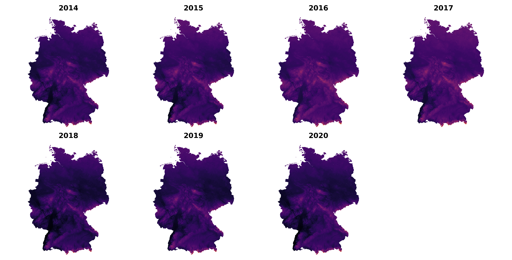
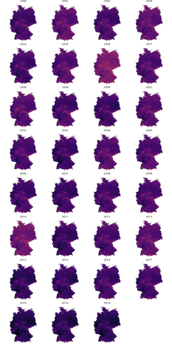

This repo is part of the LoCobSS research project. More details about the project and dependencies to other repos can be found [here](https://github.com/sebastian-meier/LoCobSS-documentation).

# locobss-dwd-transform
Transform DWD data for customized [story-telling](https://github.com/sebastian-meier/locobss-story-climate-risk-zones)



## Overview
This set of scripts:
- Creates a set of postgresql tables. 
- Creates a spatial grid based on the weather data.
- Imports historic data into the database.
- Queries polygons agains the database and receives a timeseries dataset with (min/max/average@timestamp).

## Preparations
- Create a virtual env (optional) e.g.
```bash
virtualenv --python=python3.8 env
source env/bin/activate
```
- Install dependencies through requirements.txt
```bash 
pip install -r requirements.txt
```
- Create .env file (see .env-sample)

## Process

### Creating the postgresql tables
```
python setup.py
```

### Download data from the German Weather Service (DWD)
There are lots of different data sets on the dwd server, this script has been tested with the following folders: drought_index, frost_days, hot_days, ice_days, precipitation, precipGE30mm_days, snowcover_days, summer_days
You can download the data easily via FTP: opendata.dwd.de (no login required), PATH: /climate_environment/CDC/grids_germany/annual/

### Create the spatial grid (data needs to be in the INPUT folder)
Provide the path to one of the gzipped asc files as the base for the grid
```
python grid.py PATH_TO_FILE.asc.gz
```

### Import the data
Set the INPUT_PATH to point to your folder containing the DWD data. Provide a comma separated list of data sets you want to import
```
python import.py drought_index,frost_days
```

### Generate Summaries
```
python summary_germany.py
python summary_postcode.py
```
If you have other spatial units than postcode, you simply need the change the table names in *summary_postcode.py*.

**At this point you can start building your queries!**

**You can also import other data with the same approach, e.g. https://www.ufz.de/index.php?de=47252**

### Generate timeseries geojson
This will generate one geojson for each data type stored in the data table
```
python timeseries.py
```
#### Simplification of timeseries

```bash
geo2topo timeseries.geojson > timeseries.topo.json
toposimplify -p 0.00000001 -F timeseries.topo.json -o timeseries.simple.topo.json
topoquantize 1e5 timeseries.simple.topo > timeseries.simple2.topo.json
```

### Test the data
You can run the *small-multiples.py* to generate small multiple visualisations for the data in your database.
```
python small-multiples.py
```



### Setup your spatial units
Create a table for either postcode, municipality or ags2, each should contain at least id and geom. You can find data for each at: https://gdz.bkg.bund.de/index.php/default/open-data.html

### Import climate risk data
If you want to build the same regional reports you need additional data and tables:

- climate_grid_zones: **./data/klimazonen.zip** Derived from [Umweltbundesamt](https://www.umweltbundesamt.de/sites/default/files/medien/376/dokumente/handlungsfelduebergreifende_schwerpunkte_der_folgen_des_klimawandels_1.pdf)
- flood_ocean: **./data/sturmflut.zip** Derived from [Umweltbundesamt](https://www.umweltbundesamt.de/sites/default/files/medien/376/dokumente/handlungsfelduebergreifende_schwerpunkte_der_folgen_des_klimawandels_1.pdf)
- dense_spaces: **./data/verdichtungsraeume.zip** Derived from [MKRO](https://www.bbsr.bund.de/BBSR/DE/forschung/raumbeobachtung/Raumabgrenzungen/deutschland/gemeinden/Verdichtungsraeume/verdichtungsraeume.html)
- flood_hazard: **./data/hochwasser-low-res.zip** Derived from [BAfG](https://geoportal.bafg.de/inspire/download/NZ/servicefeed.xml)

### Generate reports for spatial units
If you have imported everything, you can run the reports:
```
python generate.py
```

### Upload the reports to S3
If you have imported everything, you can run the reports:
```
python upload.py
```

## Data Source @ DWD
https://opendata.dwd.de/climate_environment/CDC/grids_germany/annual/

